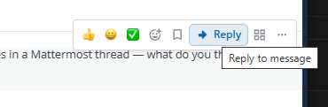
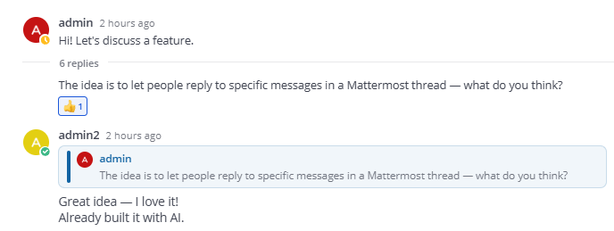

# Channel Reply — Mattermost Plugin

Reply to a specific message **in the channel stream** (with a quote block), or in a thread — without manual copy-paste quoting.

> **Disclaimer:** This plugin was developed with the help of AI-assisted coding tools. It is provided as-is — use at your own discretion. Review the code before deploying to production, test in your environment, and keep in mind that behavior may differ across Mattermost versions and clients.

## Screenshots

**Reply button** on the message action bar:



**Quoted reply in a thread** — the original message is shown as a clickable quote block above the reply:



## Features

- **Reply in channel** — reply to a root message from the main channel composer; the answer appears as a separate channel message with a quoted reference (does not open the thread sidebar).
- **Reply in thread** — reply from the thread sidebar or via **Thread** in the post menu; the answer stays in the thread.
- **Clickable quotes** — clicking a quote block navigates to the original message using Mattermost permalinks (scroll + highlight).
- **Quote UI** — quote bar, compact preview above the composer, up to 5 lines of quoted text.

## Mobile app

The plugin UI (Reply button, quote block, composer preview) runs only in the **web and desktop** clients.

Quoted replies **can be read** in the native mobile app: the post message includes a markdown blockquote with the author name and quoted text. Creating quoted replies from the mobile app is not supported.

## Requirements

- Mattermost **9.0+** (tested with 10.5.x)
- Node.js **18+** and npm (for building the webapp bundle)
- **Collapsed threads (CRT)** enabled on the Mattermost server

## Build

```bash
make dist
```

This installs webapp dependencies, builds `webapp/dist/main.js`, and creates:

```
dist/com.github.mattermost-channel-reply-1.1.0.tar.gz
```

Other commands:

```bash
make webapp   # build webapp only
make clean    # remove dist/ and node_modules/
```

## Install

### System Console

1. Open **System Console → Plugins → Plugin Management**
2. Set **Enable Plugins** and **Enable Uploads** to `true`
3. Click **Upload**, select the `.tar.gz` bundle from `dist/`
4. Enable **Channel Reply**

### mmctl

```bash
mmctl plugin upload dist/com.github.mattermost-channel-reply-1.1.0.tar.gz
mmctl plugin enable com.github.mattermost-channel-reply
```

### API

```bash
mmctl plugin upload dist/com.github.mattermost-channel-reply-1.1.0.tar.gz
# or POST /api/v4/plugins with the bundle as multipart form field "plugin"
mmctl plugin enable com.github.mattermost-channel-reply
```

After installation, reload the Mattermost web client (hard refresh: **Ctrl+F5**).

## Server configuration

No plugin settings are required. For thread replies to work as intended:

- **System Console → Environment → Collapsed Threads** → `always_on`
- **Thread auto-follow** recommended

## Forking

If you publish your own fork, update the plugin ID in:

- `plugin.json`
- `webapp/src/manifest.ts`
- `webapp/src/types/store.ts` (`PLUGIN_STATE_KEY`)
- `Makefile`

Use a reverse-DNS ID you control, e.g. `com.example.mattermost-channel-reply`.

## Project layout

```
├── plugin.json       # Plugin manifest
├── Makefile          # Build & bundle
├── webapp/           # React/TypeScript source
│   ├── src/
│   └── package.json
└── LICENSE
```

## License

MIT — see [LICENSE](LICENSE).
